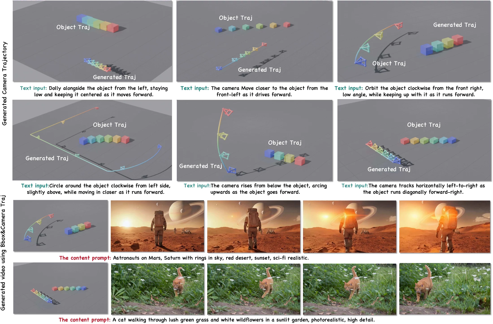
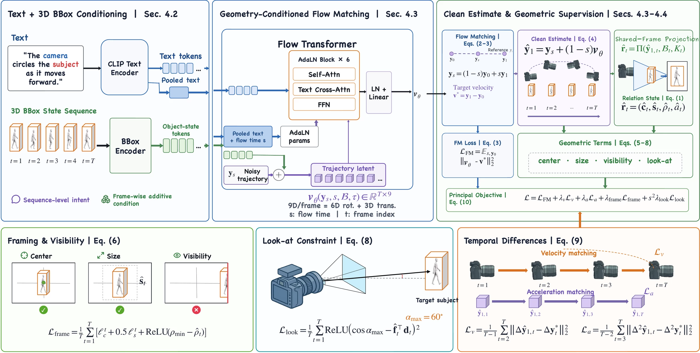
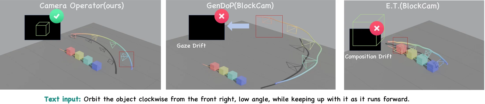
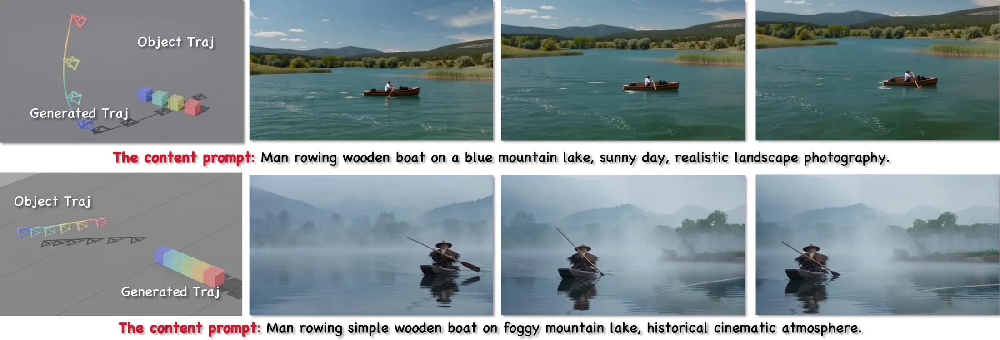

<div align="center">

# Camera Operator

### Object-Grounded Camera Trajectory Generation from Text and 3D Bounding Box Sequences

**Accepted at ACM Multimedia 2026**

<p><a href="https://orcid.org/0009-0004-9539-3050">Zhongyuan Hu</a><sup>1</sup> &nbsp;·&nbsp; <a href="https://orcid.org/0009-0005-7477-5938">Yue Ma</a><sup>2,*</sup> &nbsp;·&nbsp; <a href="https://orcid.org/0009-0008-9172-6515">Jiangming Wang</a><sup>3</sup> &nbsp;·&nbsp; <a href="https://orcid.org/0000-0001-7703-9315">Ronghui Li</a><sup>1</sup> &nbsp;·&nbsp; <a href="https://orcid.org/0000-0003-0403-1923">Xiu Li</a><sup>1,†</sup></p>

<p><sup>1</sup>Tsinghua University &nbsp;·&nbsp; <sup>2</sup>Hong Kong University of Science and Technology &nbsp;·&nbsp; <sup>3</sup>Sun Yat-Sen University<br><sup>*</sup>Project lead. &nbsp; <sup>†</sup>Corresponding author.</p>

<p><a href="https://huzhongyyuan.github.io/CameraOperator/"></a> <a href="https://huzhongyyuan.github.io/CameraOperator/assets/camera-operator-mm26.pdf"></a> <a href="https://huggingface.co/datasets/huuuuuuuuu/CameraOperator-BlockCam"></a> </p>

**DOI assigned:** `10.1145/3767308.3835459` · ACM activation pending

</div>

<p align="center">
  <a href="https://huzhongyyuan.github.io/CameraOperator/">
    
  </a>
</p>

<p align="center">
  <em>
    Given a camera-motion instruction and a dynamic 3D target-box sequence,
    Camera Operator predicts an object-grounded 6-DoF camera trajectory.
    The bottom examples show downstream video-generation use: Camera Operator
    supplies the trajectory, while the downstream pipeline produces RGB appearance.
  </em>
</p>

## TL;DR

**Camera Operator generates 6-DoF camera trajectories from language and a time-varying sequence of target-object 3D bounding boxes.** The two inputs play complementary roles:

| Language | Dynamic 3D boxes | Flow matching |
| --- | --- | --- |
| Selects sequence-level cinematographic intent | Grounds target location, extent, orientation, and motion at each frame | Exposes an intermediate clean-trajectory estimate for geometric supervision |

```text
Camera instruction + dynamic 3D target boxes
                         ↓
          Geometry-conditioned flow matching
                         ↓
          Object-grounded 6-DoF camera trajectory
```

Camera motion is underdetermined: one scene and instruction may admit multiple valid shots. The geometric relation losses define admissible regions instead of requiring an exact camera-object relation match to one reference trajectory.

## Method

<p align="center">
  <a href="assets/method.webp">
    
  </a>
</p>

Text features and frame-wise box-state tokens condition a trajectory Transformer. Its estimated clean trajectory supports projection-space framing and visibility, shared-frame look-at, and trajectory-space temporal-difference supervision. See the [paper](https://huzhongyyuan.github.io/CameraOperator/assets/camera-operator-mm26.pdf) or the [project page](https://huzhongyyuan.github.io/CameraOperator/) for the complete formulation.

## Why object grounding?

<p align="center">
  <a href="assets/comparison.webp">
    
  </a>
</p>

The representative comparison illustrates why a smooth 3D path alone is not enough: camera generation must also preserve the designated camera-target relation as the target moves. The paper evaluates text-trajectory alignment, trajectory distribution, and camera-target relation preservation under its reported protocol; see the [camera-ready evaluation](https://huzhongyyuan.github.io/CameraOperator/assets/camera-operator-mm26.pdf#page=7) for the complete results.

## Downstream use

Camera Operator produces **camera motion, not RGB video**. Its trajectory can condition a downstream camera-controlled video generator, while projected 3D target boxes can provide object-track guidance.

<p align="center">
  <a href="assets/downstream.webp">
    
  </a>
</p>

<p align="center">
  <em>
    Downstream examples from Figure 6 of the camera-ready article. Appearance
    is specified by the content prompt; Camera Operator supplies the camera trajectory.
  </em>
</p>

## BlockCam and artifact status

The paper describes **BlockCam**, a 41K-sequence benchmark with aligned text, dynamic target-object 3D boxes, and camera trajectories. A separately audited, synthetic-only annotation release is now public on [Hugging Face](https://huggingface.co/datasets/huuuuuuuuu/CameraOperator-BlockCam). It contains 37,499 processed annotation-label records; its membership and splits differ from the accepted-paper protocol and it is not a drop-in reproduction of the paper's mixed benchmark.

| Artifact | Status |
| --- | --- |
| Project page and camera-ready article | **Available** |
| Training and inference code | Coming soon |
| Model weights | Coming soon |
| Synthetic-only BlockCam annotations | **[Available](https://huggingface.co/datasets/huuuuuuuuu/CameraOperator-BlockCam)** |
| Hugging Face | **[CameraOperator-BlockCam](https://huggingface.co/datasets/huuuuuuuuu/CameraOperator-BlockCam)** |

Code and checkpoints are not public yet. The dataset is distributed separately under the license and scope documented in its Hugging Face Dataset Card. See the [release status](RELEASE_STATUS.md) for the current public boundary.

## Citation

If you use Camera Operator in your research, please cite the ACM Multimedia 2026 paper:

```bibtex
@inproceedings{hu2026cameraoperator,
  author    = {Hu, Zhongyuan and Ma, Yue and Wang, Jiangming and Li, Ronghui and Li, Xiu},
  title     = {Camera Operator: Object-Grounded Camera Trajectory Generation from Text and 3D Bounding Box Sequences},
  booktitle = {Proceedings of the 34th ACM International Conference on Multimedia},
  year      = {2026},
  doi       = {10.1145/3767308.3835459}
}
```

## License and asset notices

The bundled camera-ready article and the listed web-display reproductions of its figures carry the article's CC BY 4.0 license. The separate synthetic-only [CameraOperator-BlockCam dataset](https://huggingface.co/datasets/huuuuuuuuu/CameraOperator-BlockCam) is released under CC BY 4.0 subject to its own Dataset Card, LICENSE, and NOTICE. Code, model weights, unreleased data or media, Unreal/Fab assets, and third-party components are not licensed as part of this repository release.

[License](LICENSE.md) · [Figure and asset notices](ASSET_NOTICES.md) · [Release status](RELEASE_STATUS.md)

Dataset-release, correction, and takedown requests: [huzhongyyuan@gmail.com](mailto:huzhongyyuan@gmail.com).
